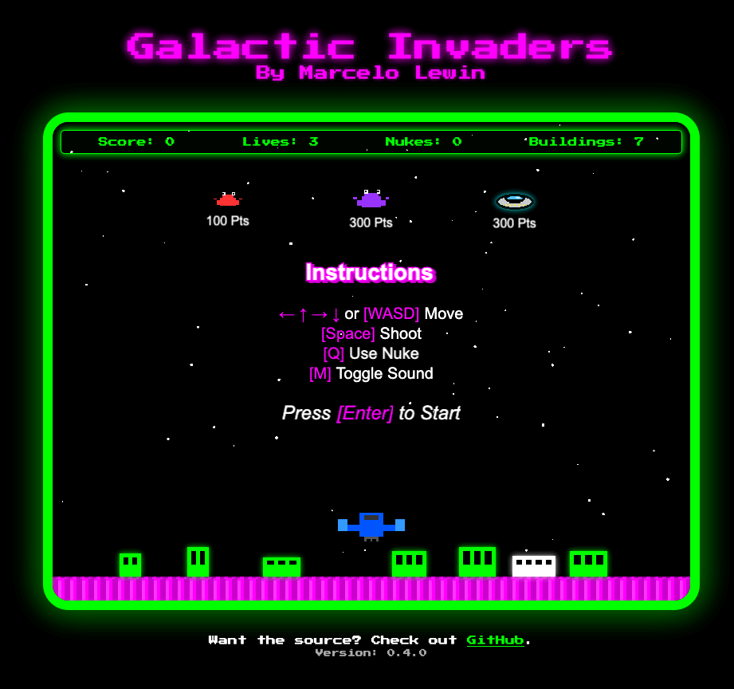

# Galactic Invaders

>A 2D "retro style" space shooter game built with HTML, CSS, and JavaScript.
> 
> **By Marcelo Lewin**

## Gameplay
Your mission is to protect your city, trying to stop waves of aliens from destroying it—or you. You can shoot them down, get temporary rapid-fire during bonus time, and unlock powerful nukes at certain score levels. The goal is simple: stay alive and protect the city.

## Where to Play It
To play the game, you can either play it [live on the web](https://galacticinvaders.icodewith.ai/) or clone this repo and run it locally using a web server (since it uses fetch() to load JSON data). If you’re running it locally, make sure to serve it with something like Live Server in VS Code or a simple HTTP server to avoid CORS issues.

## How to Play
1. Use ←, ↑, →, ↓ or [WASD] to move your spaceship
2. Press \[Space] to shoot
3. Press \[Q] to activate the nuke (when available)
4. Press \[M] to toggle sound on/off
5. Destroy aliens to earn points
6. Avoid getting hit by aliens.
7. Stop the aliens from destroying your city.
8. Try to achieve the highest score possible!

## Features
- Smooth player movement with keyboard controls
- Dynamic shooting mechanics
- Progressive difficulty with increasing alien waves
- Score tracking and lives system
- Sound effects and visual feedback
- Special nuke power-up to clear the screen
- Scrolling starfield background for immersive space atmosphere

## Controls

### Game Play
- ←, ↑, →, ↓ or \[WASD] : Move
- \[Space] : Shoot
- \[Q] : Activate nuke (when available)
- \[M] : Toggle sound on/off

## Other
- [Shift] 6 : Toggle Developer Mode
- [Shift] 5 : Show release notes
- [H] : Show/Hide help

## Why I Created It
This game was created as an experiment in learning Vibe Coding techniques and exploring AI-assisted development tools. I have zero game dev experience, so I figured, if I can, then anyone else can.  I did.  So now you know you can too!

## Technologies Used
- PixiJS for 2D rendering (via CDN)
- HTML5 Audio for sound effects (SFX from [FreeSound.org](https://www.freesound.org))
- JavaScript (ES6+)
- CSS3 for styling

## Tools Used
This game was developed using a variety of tools including:
- [Cursor](https://www.cursor.com/) (using various models)
- [Claude Code](https://www.anthropic.com/claude-code)
- ChatGPT
- Git / GitHub

## License
This project is open source and available for personal and educational use. Enjoy the game and feel free [contact me](mailto:marcelo@icodewith.ai) with updates, bugs or feedback! 🚀 

## Release Notes
Read the latest [release notes](./release_notes.md).